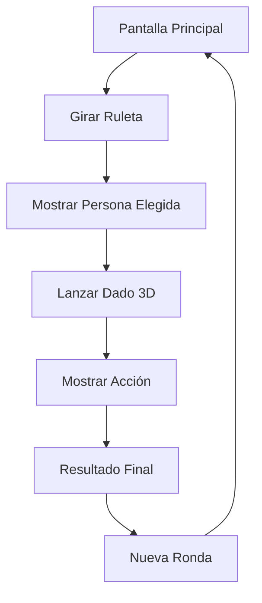

# ACEPTA COOKIES - Ruleta Musical Interactiva

Una aplicación web interactiva para el grupo musical "ACEPTA COOKIES" que permite a la audiencia participar en juegos divertidos durante las fiestas.

## 🎯 Descripción

La aplicación consiste en una ruleta que selecciona a uno de los 4 integrantes del grupo (identificados por colores de chaquetas) y un dado 3D interactivo que determina la acción que debe realizar la persona elegida.

## 🎨 Características

### ✨ Ruleta de Colores
- **4 sectores** representando a los integrantes:
  - 🔴 **Rojo**
  - 🔵 **Azul** 
  - ⚫ **Gris**
  - 🟣 **Morado**
- Animación de giro realista con desaceleración
- Efectos visuales y partículas
- Resultado aleatorio

### 🎲 Dado 3D Interactivo
- **6 acciones diferentes**:
  - 🔢 **NÚMERO**
  - 💋 **BESO**
  - 🎵 **CANCIÓN**
  - 😈 **ATREVIMIENTO**
  - 🤔 **VERDAD**
  - 💃 **BAILE**
- Manipulación 3D con gestos táctiles
- Física realista de lanzamiento
- Efectos de iluminación dinámicos

### 📱 Diseño Responsive
- Optimizado para móviles
- Gestos táctiles intuitivos
- Interfaz adaptativa
- Prevención de zoom accidental

### 🎪 Efectos Visuales
- Animaciones fluidas con CSS y JavaScript
- Efectos de confeti y partículas
- Glassmorphism y gradientes
- Transiciones suaves entre estados

## 🚀 Tecnologías Utilizadas

- **HTML5** - Estructura semántica
- **CSS3** - Estilos modernos con variables CSS, gradientes y animaciones
- **JavaScript ES6+** - Lógica de aplicación orientada a objetos
- **Three.js** - Renderizado 3D del dado interactivo
- **Google Fonts** - Tipografía Poppins

## 📁 Estructura del Proyecto

```
ruleta-cookies/
├── index.html              # Página principal
├── css/
│   ├── styles.css          # Estilos principales
│   └── animations.css      # Animaciones y efectos
├── js/
│   ├── main.js            # Lógica principal de la aplicación
│   ├── ruleta.js          # Controlador específico de la ruleta
│   └── dado3d.js          # Dado 3D con Three.js
└── README.md              # Documentación
```

## 🎮 Cómo Usar

1. **Abrir la aplicación** en el navegador
2. **Girar la ruleta** tocando el botón "GIRAR RULETA"
3. **Ver el resultado** del color/persona elegida
4. **Lanzar el dado** tocando "LANZAR DADO"
5. **Manipular el dado 3D** arrastrando con el dedo o mouse
6. **Hacer clic en el dado** para lanzarlo
7. **Ver el resultado final** con la combinación persona + acción
8. **Nueva ronda** para volver a empezar

## 🎯 Flujo de Usuario



## 🔧 Instalación y Uso

### Opción 1: Servidor Local Simple
```bash
# Navegar al directorio del proyecto
cd ruleta-cookies

# Iniciar servidor HTTP simple (Python 3)
python -m http.server 8000

# O con Node.js
npx serve .

# Abrir en el navegador
# http://localhost:8000
```

### Opción 2: Abrir Directamente
Simplemente abrir `index.html` en cualquier navegador moderno.

## 📱 Compatibilidad

- ✅ **Chrome/Chromium** (recomendado)
- ✅ **Firefox**
- ✅ **Safari**
- ✅ **Edge**
- ✅ **Móviles iOS/Android**

## 🎨 Personalización

### Colores de Integrantes
Editar en `js/main.js`:
```javascript
this.colors = {
    rojo: { name: 'ROJO', hex: '#FF4757', gradient: '...' },
    azul: { name: 'AZUL', hex: '#3742FA', gradient: '...' },
    // ...
};
```

### Acciones del Dado
Editar en `js/main.js` y `js/dado3d.js`:
```javascript
this.actions = ['NÚMERO', 'BESO', 'CANCIÓN', 'ATREVIMIENTO', 'VERDAD', 'BAILE'];
```

## 🚀 Futuras Mejoras

### Fase 2: Backend
- [ ] API REST para configuración dinámica
- [ ] Panel de administración web
- [ ] Base de datos para configuraciones
- [ ] Sistema de probabilidades personalizable
- [ ] Estadísticas de uso
- [ ] Múltiples grupos/configuraciones

### Mejoras Técnicas
- [ ] PWA (Progressive Web App)
- [ ] Modo offline
- [ ] Sonidos y efectos de audio
- [ ] Más animaciones y efectos
- [ ] Temas personalizables
- [ ] Integración con redes sociales

## 🎵 Sobre ACEPTA COOKIES

Grupo musical que lleva la fiesta a festivales de manera alternativa, montando su propia diversión en bares y espacios, creando experiencias únicas para el público.

## 📄 Licencia

Este proyecto está creado específicamente para el grupo musical "ACEPTA COOKIES".

---

**¡Que empiece la fiesta! 🎉**
